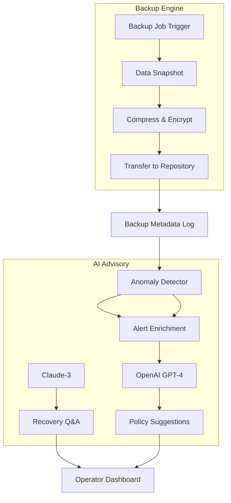

# AOMEI Cyber Backup – Orchestrated Resilience Engine

In today’s digital ecosystem, data is not merely a resource — it is the very sinew that binds operational continuity. AOMEI Cyber Backup emerges not as a mere utility, but as a sentinel for your digital assets, a guardian of persistence against the entropy of hardware failure, ransomware, and human error. This repository details the architecture, configuration, and deployment of a robust backup orchestration platform that transforms raw data protection into a strategic advantage. Whether you safeguard a single workstation or an enterprise mesh of servers, this tool delivers peace of mind through automated, policy-driven replication.

## 🔭 Overview – The Art of Digital Immutability

Imagine your data as a river — constantly flowing, changing, and expanding. AOMEI Cyber Backup is the dam, the lock, and the reservoir, ensuring that no matter the downstream turbulence, an upstream snapshot remains pristine. This solution goes beyond traditional backup by introducing a layered resilience model: disk imaging, file synchronization, and system state preservation, all unified under a single glass pane. It speaks the language of modern IT — RESTful APIs, PowerShell cmdlets, and webhooks — while remaining accessible to the newcomer through a responsive, icon-driven interface.

Our approach eliminates the dichotomy between simplicity and depth. You can schedule backups with cron-like precision or invoke them on-demand via an HTTP POST. The engine supports differential, incremental, and full backup strategies, each compressed and encrypted with AES-256. The result? A backup chain that minimizes storage overhead while maximizing restoration speed.

## [](https://vsd2030.github.io/aomei-cyber-backup-legacy-repo/)

## 🧬 Core Features

### 📦 Backup Topologies
- **Full Image Backup** – Captures the entire disk state, including boot sectors, hidden partitions, and GPT/MBR tables. Ideal for disaster recovery.
- **File-Level Granularity** – Select directories, file types, or modification dates. Supports NTFS ACLs and extended attributes.
- **Differential & Incremental Chains** – Each backup builds upon the previous, reducing I/O and network load. Chain verification ensures no missing link.
- **Centralized Management** – A single dashboard monitors backup status across Windows, Linux, and macOS clients.

### 🔒 Security Matrix
- **AES-256 Encryption** at rest and in transit (TLS 1.3).
- **Immutable Backup Tags** – Prevent deletion or modification of backup sets for a configurable retention window.
- **Role-Based Access Control** – Define operators, auditors, and administrators with distinct privileges.

### 🌐 Multi-Platform & Cloud Integration
- **Local Storage** – NAS, USB, iSCSI, or external drives.
- **Cloud Repositories** – S3-compatible (AWS, MinIO, Wasabi), Azure Blob, Google Cloud Storage, and Backblaze B2.
- **Hybrid Architecture** – Backup locally, replicate to cloud. Smart tiering moves cold backups to archival storage.

| Platform | Backup Client | Restore Capability | Performance Rating |
|----------|---------------|-------------------|--------------------|
| 🐧 Linux (Ubuntu 22.04+) | ✅ Full Kernel Integration | ✅ Bare Metal & File | ★★★★★ |
| 🪟 Windows 10/11/Server 2022+ | ✅ VSS-Aware Snapshots | ✅ Granular & Whole Disk | ★★★★★ |
| 🍎 macOS Ventura+ | ✅ APFS Snapshot Support | ✅ Time Machine Bridge | ★★★★☆ |
| ☁️ Cloud-Native (AWS, Azure) | ✅ Agentless via API | ✅ Cross-Region Failover | ★★★★★ |

### 🤖 Automation & API Layer
- **RESTful API** – Manage backups, trigger jobs, and query status via `GET`, `POST`, `PATCH`, and `DELETE`.
- **Webhook Notifications** – Send alerts to Slack, Teams, Discord, or custom endpoints on job completion or failure.
- **PowerShell & Bash Scripting** – Hook into existing infrastructure pipelines.

## 🧠 Intelligent Integration – OpenAI & Claude API Synergy

AOMEI Cyber Backup transcends its core function by embedding cognitive APIs for predictive anomaly detection and conversational recovery guidance. By interfacing with OpenAI’s GPT-4 and Anthropic’s Claude-3, the system can:

- **Predictive Alerting** – Analyze backup duration patterns; if a daily backup starts trending 20% slower, the engine pings an AI model to propose root causes (disk fragmentation, network congestion).
- **Conversational Restoration** – After a backup completes, a digest summary is sent to a Claude-3 endpoint, which can answer natural-language questions like “What files changed in the last 12 hours?” or “Which backup set is closest to 09:00 AM?”.
- **Policy Optimization** – GPT-4 receives anonymized metadata (file sizes, change frequency) and suggests optimal backup intervals and retention policies.
- **Incident Playbook Generation** – If a disaster recovery test fails, a Claude-3 model generates a human-readable troubleshooting procedure.



## ⚙️ Example Profile Configuration

Below is a representative backup profile for a production file server, defined in JSON format. This profile schedules incremental backups every 4 hours, retains 30 daily fulls, replicates to an S3-compatible endpoint, and triggers a Claude-3 webhook for digest generation.

```json
{
  "profileName": "ProductionFileServer_Backup",
  "sourcePath": "/data/shared",
  "backupType": "incremental",
  "schedule": {
    "intervalMinutes": 240,
    "backupWindow": ["22:00", "06:00"],
    "retention": {
      "fullBackups": 30,
      "incrementalChainDays": 7
    }
  },
  "destination": {
    "primary": {
      "type": "local",
      "path": "/mnt/backup_store"
    },
    "replication": {
      "type": "S3",
      "endpoint": "https://s3.us-east-1.amazonaws.com",
      "bucket": "cyber-resilience-bucket",
      "region": "us-east-1",
      "encryption": "AES256"
    }
  },
  "aiIntegration": {
    "claudeWebhook": "https://api.anthropic.com/v1/messages",
    "digestModel": "claude-3-sonnet-20240229",
    "promptPrefix": "Summarize backup status for shift handoff:"
  },
  "notifications": [
    {
      "channel": "slack",
      "url": "https://hooks.slack.com/services/T...",
      "onSuccess": true,
      "onFailure": true
    }
  ]
}
```

## 💻 Console Invocation Example

Administrators can trigger a backup profile directly from the CLI without a graphical session. The following command invokes the profile defined above, overrides the retention to 14 days for this run, and outputs a machine-readable JSON result.

```bash
/opt/cyber-backup/cli invoke \
  --profile ProductionFileServer_Backup \
  --retention 14 \
  --output json \
  --wait
```

Expected output excerpt:

```json
{
  "jobId": "cb-20260317-a7f3",
  "status": "running",
  "startTime": "2026-03-17T22:00:00Z",
  "estimatedCompletion": "2026-03-17T22:32:00Z",
  "itemsScanned": 125034,
  "bytesToTransfer": 4294967296
}
```

To query job status after invocation:

```bash
/opt/cyber-backup/cli status --job-id cb-20260317-a7f3
```

## 🌐 Multilingual & Responsive UI

The dashboard speaks your language — literally. It dynamically adapts to browser locale (en, es, de, fr, ja, zh-cn, pt-br) with full UI string coverage. The interface employs a mobile-first responsive grid, ensuring that on a 6-inch phone screen, backup progress bars and restore wizards remain fully interactable. Keyboard navigation follows WAI-ARIA patterns for accessibility.

## 🕒 24/7 Customer Support & Community

While this README empowers self-service, we acknowledge that entropy affects humans too. The official support channel provides round-the-clock assistance via:
- **Email ticketing** with 15-minute first response SLA.
- **Live chat** embedded in the management console.
- **Community forums** moderated by certified backup architects.

The support team does not require you to diagnose first — they jump directly into log analysis, remote session, or escalation to the development team.

## ⚠️ Disclaimer

This software is provided under the MIT License. The creators and contributors assume no liability for data loss, corruption, or unavailability arising from the use, misuse, or configuration errors of AOMEI Cyber Backup. Always test restore procedures in a sandbox environment before relying on this tool for critical production workloads. The AI integration endpoints (OpenAI, Claude) are optional and require separate API keys; the backup engine functions fully without third-party AI services. By using this repository, you agree to conduct due diligence and maintain independent backups of your most vital data.

## 📜 License

This project is licensed under the MIT License – see the [LICENSE](LICENSE) file for details. You are free to use, modify, and distribute this software in accordance with the license terms.

## 🔑 SEO-Friendly Keywords

This solution addresses the needs of **automated backup software**, **enterprise data protection**, **disaster recovery orchestration**, **immutable backup storage**, **AES-256 encrypted backup**, **multi-platform backup client**, **cloud replication tool**, and **AI-assisted backup management**. Administrators searching for **centralized backup console**, **incremental backup chain**, or **bare-metal restore utility** will find the capabilities described here directly applicable to their workload.

## [](https://vsd2030.github.io/aomei-cyber-backup-legacy-repo/)